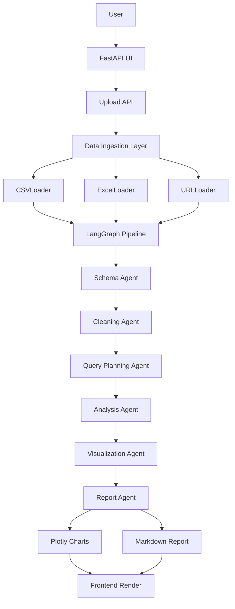

# AI Data Analyst Agent

A multi-agent analytics platform built on **LangGraph** that accepts CSV/Excel datasets, processes them through a sequential agent pipeline, and produces statistical analysis, Plotly visualizations, and an AI-generated report — all via a natural language interface.


## Architecture




## Tech Stack

| Layer | Technologies |
|---|---|
| **API / Frontend** | FastAPI, Jinja2, HTML/CSS, JavaScript |
| **Orchestration** | LangGraph, LangChain |
| **LLM** | OpenAI GPT-4o |
| **Data** | Pandas, NumPy |
| **Visualization** | Plotly |
| **Config** | YAML, Pydantic Settings, `.env` |
| **Infra** | Docker, Docker Compose, Azure Container Apps |


## Agent Pipeline

Each agent in the LangGraph graph has a single, bounded responsibility:

| Agent | Responsibilities |
|---|---|
| **Schema Agent** | Column profiling, null/unique analysis, LLM-based role classification, target variable detection |
| **Cleaning Agent** | Null handling, type casting, outlier capping, cleaning audit log |
| **Query Planning Agent** | Natural language → Pandas code generation |
| **Analysis Agent** | Safe code execution, descriptive stats, correlation analysis, value counts |
| **Visualization Agent** | Distribution charts, correlation heatmaps, categorical analysis |
| **Report Agent** | Executive summary, statistical insights, recommendations |


## Repository Structure

```
DATA-ANALYST-AGENT/
├── src/
│   ├── agents/              # LangGraph agent nodes
│   ├── ingestion/           # BaseLoader, CSVLoader, ExcelLoader, URLLoader
│   ├── pipeline/            # LangGraph graph definition and state
│   ├── api/                 # FastAPI routes and request handlers
│   ├── frontend/            # Jinja2 templates, static assets
│   └── config/              # YAML configs and Pydantic settings
├── tests/                   # Unit and integration tests
├── notebooks/               # Exploratory analysis and prototyping
├── infra/
│   └── azure/               # Azure Container Apps deployment manifests
├── .github/
│   └── workflows/           # CI/CD pipeline definitions
├── Dockerfile
├── docker-compose.yml
├── pyproject.toml
├── requirements.txt
└── requirements-dev.txt
```


### Data Ingestion

The ingestion layer uses a factory pattern over a `BaseLoader` interface:

- **CSVLoader** / **ExcelLoader** — file-based ingestion with schema inference
- **URLLoader** — remote dataset ingestion
- **File Validator** — enforces file type, size limits, and non-empty dataset checks


### Design Principles

- **Modular agents** — each node is independently testable and replaceable
- **Config-driven** — agent behaviour, thresholds, and model selection controlled via YAML
- **Separation of concerns** — ingestion, orchestration, and presentation are fully decoupled
- **Safe code execution** — LLM-generated Pandas code runs in a sandboxed evaluation context
- **Cloud-ready** — Dockerfile + Azure Container Apps target included


## Status

| Component | Status |
|---|---|
| Data Ingestion Layer | ✅ Complete |
| LangGraph Agent Pipeline | ✅ Complete |
| Plotly Visualization | ✅ Complete |
| AI Report Generation | ✅ Complete |
| FastAPI Frontend | ✅ Complete |
| Docker / Docker Compose | ✅ Complete |
| GitHub Actions CI | 🔲 Planned |
| Unit & Integration Tests | 🔧 In Progress |
| MongoDB Persistence | 🔲 Planned |
| Azure Blob Storage | 🔲 Planned |
| Azure Container Apps Deploy | 🔲 Planned |
| LangSmith Tracing | 🔲 Planned |


## Roadmap

- Persistent session storage (MongoDB)
- Remote file ingestion via Azure Blob Storage
- CI/CD via GitHub Actions → Azure Container Registry → Azure Container Apps
- LangSmith tracing and structured logging
- Expanded test coverage with coverage reporting


