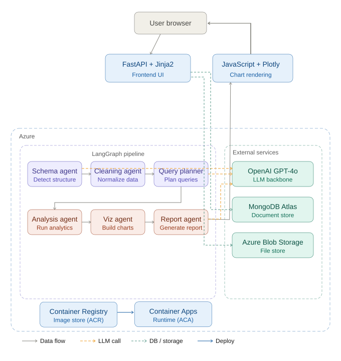
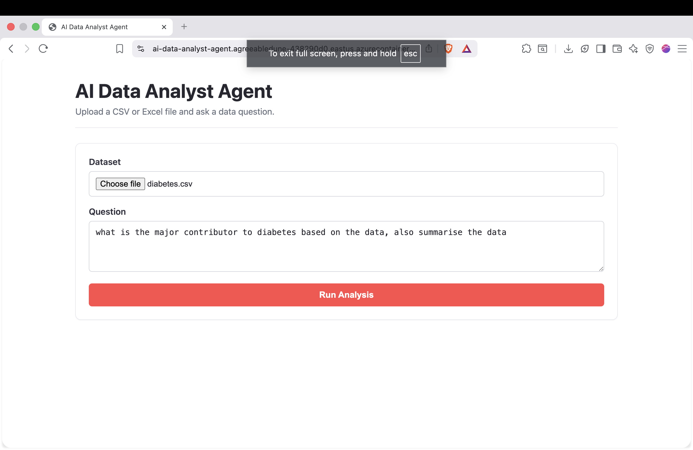

# AI Data Analyst Agent

A multi-agent analytics platform built on **LangGraph** that accepts CSV/Excel datasets, processes them through a sequential agent pipeline, and produces statistical analysis, Plotly visualizations, and an AI-generated report — all via a natural language interface.

## Architecture

## Live Deployment

The application is deployed on Microsoft Azure using a cloud-native architecture.

### Deployment Stack

- Azure Container Apps
- Azure Container Registry (ACR)
- Azure Blob Storage
- MongoDB Atlas
- OpenAI GPT-4o

### Live Application

[Launch AI Data Analyst Agent](https://ai-data-analyst-agent.agreeabledune-438290d0.eastus.azurecontainerapps.io/)

### Demo Video

## Tech Stack

| Layer | Technologies |
|---|---|
| API / Frontend | FastAPI, Jinja2, HTML/CSS, JavaScript |
| Orchestration | LangGraph, LangChain |
| LLM | OpenAI GPT-4o |
| Data | Pandas, NumPy |
| Visualization | Plotly |
| Config | YAML, Pydantic Settings, .env |
| Infra | Docker, Azure Container Apps, Azure Blob Storage, MongoDB Atlas |

## Agent Pipeline

| Agent | Responsibilities |
|---|---|
| Schema Agent | Column profiling, null/unique analysis, LLM-based role classification, target variable detection |
| Cleaning Agent | Null handling, type casting, outlier capping, cleaning audit log |
| Query Planning Agent | Natural language → Pandas code generation |
| Analysis Agent | Safe code execution, descriptive stats, correlation analysis, value counts |
| Visualization Agent | Distribution charts, correlation heatmaps, categorical analysis |
| Report Agent | Executive summary, statistical insights, recommendations |

## Status

| Component | Status |
|---|---|
| Data Ingestion Layer | ✅ Complete |
| LangGraph Agent Pipeline | ✅ Complete |
| Plotly Visualization | ✅ Complete |
| AI Report Generation | ✅ Complete |
| FastAPI Frontend | ✅ Complete |
| Docker | ✅ Complete |
| MongoDB Persistence | ✅ Complete |
| Azure Blob Storage | ✅ Complete |
| Azure Container Apps Deploy | ✅ Complete |
| Unit Tests | ✅ Complete |
| Integration Tests | ✅ Complete |
| GitHub Actions CI | ✅ Complete |
| LangSmith Tracing | ✅ Complete |

## Roadmap

- LangSmith observability and tracing
- Authentication and user management
- Enhanced analytics workflows
- Additional chart types and export options
